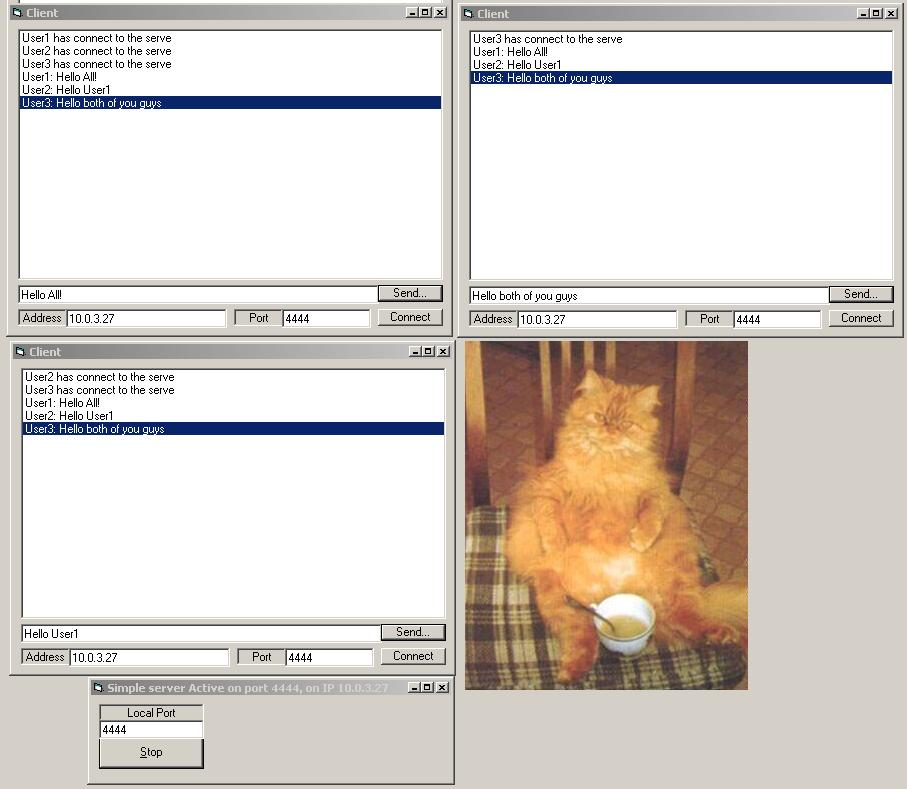

## COMPLETE Client & Server Application with winsock \(only 50 lines of code\) tons of clear Comments

### Description

This gives a complete, Error-Correcting, Client and server to demonstrate communications via winsock. You may substitute the CLient program for any Telnet application. 

The telnet Server has only 22 lines of code, which does include error correction for any text based connections. 

The Client App has only 28 lines of code, with complete commenting and explataions for why errors arise, not just that they do show up.
 
### More Info
 
On the running applications, the server wil want a port number. 

the client will want the port and the Address(incase you don't know it, strecth out the server form, and it will tell you that)

The code should also work on VB5, I spotted nothing altered between versions as far as this code goes, however I have ONLY tested this in VB6

There are no returns, Only usage

If the program is killed unformaly it may leave the port tied up for a few minutes. Nothing that important.

             |
---                |---
**Submitted On**   |2001-05-24 13:50:50
**By**             |[Dan Violet Sagmiller](https://github.com/Planet-Source-Code/PSCIndex/blob/master/ByAuthor/dan-violet-sagmiller.md)
**Level**          |Intermediate
**User Rating**    |5.0 (15 globes from 3 users)
**Compatibility**  |VB 5\.0, VB 6\.0
**Category**       |[Complete Applications](https://github.com/Planet-Source-Code/PSCIndex/blob/master/ByCategory/complete-applications__1-27.md)
**World**          |[Visual Basic](https://github.com/Planet-Source-Code/PSCIndex/blob/master/ByWorld/visual-basic.md)
**Archive File**   |[COMPLETE C200065242001\.zip](https://github.com/Planet-Source-Code/dan-violet-sagmiller-complete-client-server-application-with-winsock-only-50-lines-of-code__1-23406/archive/master.zip)

